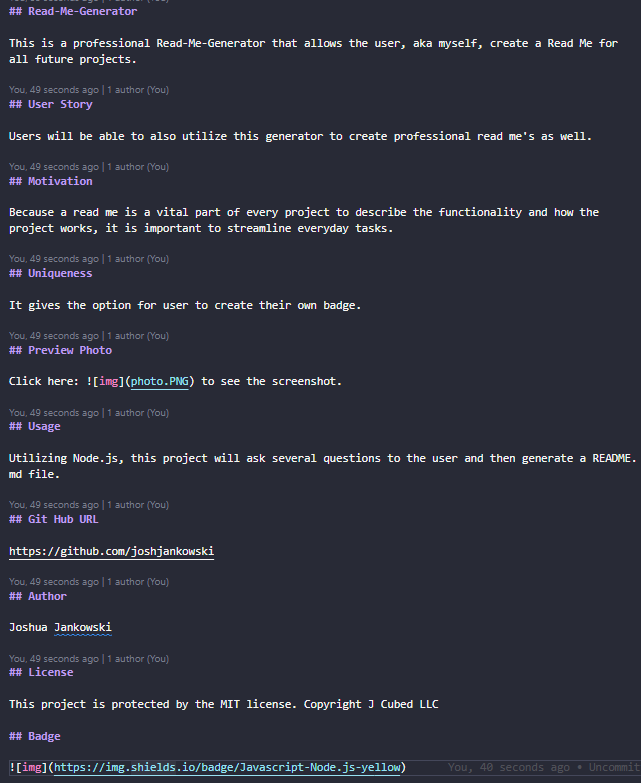

## Read-Me-Generator

This is a professional Read-Me-Generator that allows the user, aka myself, create a Read Me for all future projects.

## User Story

Users will be able to also utilize this generator to create professional read me's as well.

## Motivation

Because a read me is a vital part of every project to describe the functionality and how the project works, it is important to streamline everyday tasks.

## Uniqueness

It gives the option for user to create their own badge.

## Preview Photo

Click here:  to see the screenshot.

## Usage

Utilizing Node.js, this project will ask several questions to the user and then generate a README.md file.

## Git Hub URL

https://github.com/joshjankowski

## Author

Joshua Jankowski

## License

This project is protected by the MIT license. Copyright J Cubed LLC

## Badge

